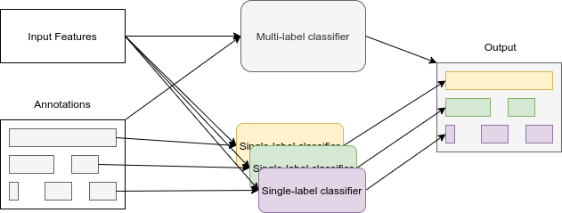

# Sound Event Detection Framework

This project was developed in the context of my [bachelor thesis](docs/Thesis.pdf) at JKU - Johannes Kepler Universität Linz.

### Purpose
The framework detects sound events in polyphonic audio files using a neural network (CNN+FNN) trained with supervised learing.  
It outputs the onset (start) and offset (end) of any (known) event for each timestep.  
The network is first trained on annoated data and then tested against a separate test set.  
Metrics like F-score and error rate are then computed to see the effectiveness of the input features and post-processing methods.  
Using different command line arguments, the performance of different feature types can be compared for each dataset scene.  

### Polyphonic Sound Event Detection
Polyphony makes the task harder.  
In monophonic audio (only one event active at a time) we can simply train a network to output the currently active (or no) event.  
In polyphonic sound event detection, multiple events can be active at the same time. That's why, at each frame position, we need a binary value for each event class.
This is visualized in the figure below:  


As a consequence the sound data of multiple events can overlap, creating a new kind of event (mixture) which can be hard to match/compare with "known sound class patterns".  

### Input Features Types

For effective detection we pre-process the audio stream using the discrete fourier transformation (FFT) and use spectral image features as inputs. 
Supported features types currently are:
- logarithmic raw spectrograms
- logarithmic Mel energies
- Mel frequency cepctral coefficients

The used feature type can be chosen when calling the `main.py` file. (see [Usage](#Usage))

### Dataset:
The dataset used for our analysis is TUT-SED 2016.
It consists of:
- strong labels
- real-life recordings
- two different sound scenes
- 18 sound classes, distinct by scene

The dataset was used as a baseline in the [DCASE2016 challenge, Task 3](http://dcase.community/challenge2016/task-sound-event-detection-in-real-life-audio).  
It features a total of 18 sound classes, divided into two very different sound scenes.  
For the challenge, the recorded data were split 70/30 into [development set](https://zenodo.org/record/45759) and [evaluation set](https://zenodo.org/record/996424).  
The development set’s "home" recordings consist of 11 different sound classes totaling about 36 minutes.  
The "residential area" recordings sum up to a length of 42 minutes and contain only 7 distinct sound classes.  
In the evaluation split, another 18 minutes of each scene is available.  

### Run modes
Another important topic of my paper was to compare performance of single-scene and multi-scene detection.  
Single-scene means that either "home" or "residential area" data are used to train the network.  
It can then only detect those events that occur in this scene (need to train 2 separate networks for events in whole dataset).  
Multi-scene trains on both (all) scenes of the dataset and predicts all event types for any sound file.

The differnce is show in the below graphic:



### Usage:
The framework is called by invoking python on the `main.py` file.   
The three additional parameters required are: `feature type`, `scene` and `config`.

- `feature type` - the input feature type to be used. Has to be one of:
  - *mels* - for log Mel energies
  - *mfcc* - for Mel frequency cepstral coefficients
  - *spec* - for logarithmic weighted spectrograms
- `scene` - the part of dataset used, depending on the acoustic environment it was recorded in:
  - *indoor* - the "home" part of the dataset
  - *outdoor* - the "residential area" part of the dataset
  - *all* - the combination of both "home" and "residential area" (multi-scene)
- `config` - a json-file containing common hyper parameters for the STFT, the network, logging, excerpt length, feature size, etc.


Eample:
```
python main.py mels indoor config.json
```

### Implementation Details

If non-existent on the hard drive, the TUT-SED 2016 datasets will be downloaded automatically.  
As a next step, STFT spectrograms of all recordings in each scene, as well as the respective target arrays according to the annotations provided, 
will be pre-computed and saved in a `pickle` file.  
Then, in a background thread, excerpts of those spectrograms will be prepared, applying several [data augmentation methods](#data-augmentation) in the process.

3/4 of the development set was used as our training set, and 1/4 was used as a validation set.  
Splits were done based on the information provided in the dataset's evaluation-setup.  
The currently known best network model is only updated if the new validation loss is less than the previous one.  

During training, at each validation step, intermediate metrics and plots are generated in `resuts/intermediate` to observe model progress.  
The figure below shows an example plot of an excerpt of a residential area recording with a length of 512 frames, 
illustrating the targets gathered from provided annotations, the network predictions, and the error resulting from taking the difference of both.


After training is finished, the final evaluation is initiated.  
All data from the development set and evaluation set are fed to the network.  
Metrics are calculated on file level as well as dataset level.  
Additionally, targets, predictions, and errors are plotted for each file separately.  
The results are stored on disk and automatically zipped after each run.  

#### Architecture
The architecture of the default network is shown below:  


The input of our network has a size of (B, 1, F, T). 
- B stands for the batch size, meaning how many samples are fed to the network at the same time.  
- 1 (or later K) represents the number of input channels, defined by the number of kernels used in the previous layer.  
- F is the feature dimension size, which is depending on the type of input features used.  
- T is the number of time-steps (or amount of frames in one excerpt).  

The dataset consists of recordings with a duration between three and five minutes.  

Because these recordings are too large to input into the network whole, input data is fed to the network in excerpts of configurable length.  

The batch and time dimensions are never reduced.

As a non-linear activation function, we added the commonly used Rectified Linear Unit (ReLU) after each CNN block.

The binary-cross-entropy loss function combined with the Adam optimizer is used for estimating loss and performing stochastic gradient descent (SGD) to optimize our model.

#### Post-processing 
A few post-processing techniques are applied to try to improve scores of the network output.  
Metrics are automatically calculated for both post-processed and non-post-processed versions.  

Applied methods currently are:
- 10-frame windowing to smoothen output
- normalizing segments to a minimum event length and minimum inter-event gaps (from baseline)
- detecting an additional silence or "background" class and removing all other events if silence was detected

#### Data Augmentation
To improve generalization of out network we also experimented with several data augmentation techniques.  
These are applied during excerpt generation.  

Used currently:
- Random gaussian noise
- Random spectrogram streching (+- 30%, only in height)
- Random dB alteration (+- 30%, on whole spectrogram)
- Random filtering (+-10% on a random part of an excerpt)

#### Tensorboard

The `tensorboard` python module was used to tune the parameters.  
Losses, gradients, and metrics during training are logged in tensorboard, combined with the hyper-parameters used.  
This allowed to visualize the effects of different parameter values in combination with the resulting score.  
Using the "parallel coordinates view", I was able to manually inspect the result of different parameter combinations and optimize their performance.  

### Libraries

Important python packages and libraries include:
- `numpy`
- `librosa`
- `torch` (PyTorch)
- `scipy`
- `matplotlib`
- `tqdm`
- `requests`
- `dill`
